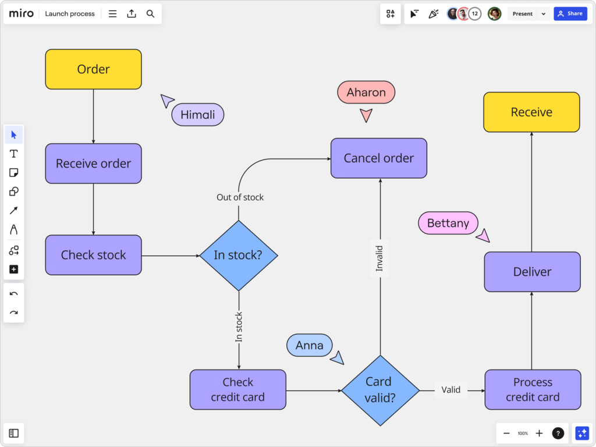

# Introduccion

Analista Programador - Programacion I

<br>
<br>
<br>

Profesor
###### Matias Verges

---

## Objetivos del Taller

- Identificar los principios básicos de usabilidad y accesibilidad web.
- Evaluar la usabilidad y accesibilidad de un sitio web.
- Aplicar técnicas y herramientas para mejorar la usabilidad y accesibilidad.
- Diseñar y desarrollar sitios web accesibles y usables.
- Comprender la importancia de estos aspectos en el diseño web.

---


---


---



---


---


---

```csharp
 public int testeo() {
      int numero = 15;
      string cadena = "Hola cacarola string string string string strin stringstring string string";

      if(cadena.length < numero) 
      {
            Console.WriteLine("asd");
      }else if(cadena.length > numero); 
      {
            Console.WriteLine("asdasda");
      }else 
      {
            Console.WriteLine("ojo");
      }  

      if(cadena.length < numero) 
      {
            Console.WriteLine("asd");
      }else if(cadena.length > numero); 
      {
            Console.WriteLine("asdasda");
      }else 
      {
            Console.WriteLine("ojo");
      }  

      if(cadena.length < numero) 
      {
            Console.WriteLine("asd");
      }else if(cadena.length > numero); 
      {
            Console.WriteLine("asdasda");
      }else 
      {
            Console.WriteLine("ojo");
      }  
  Console.WriteLine("ojo");
      }  

      return cadena.length;
} 

---


---


---

# Clase 1: Introducción a la Usabilidad y Accesibilidad Web

## Introducción

- Los sitios web profesionales deben cumplir con los estándares de accesibilidad y usabilidad establecidos por la W3C.
- Este taller abordará conceptos básicos, técnicas y herramientas para evaluar y mejorar la calidad de un sitio web.

---

## Dinámica de Clase Virtual

### Reglas de Participación
- Cámara web siempre encendida
- Micrófono siempre muteado
- Utilizar auriculares para evitar eco y ruido de fondo

### Comportamiento Esperado
- Mantenerse atento y participar activamente en las clases
- Respetar los horarios y tiempos de las clases

### Uso de Herramientas de Comunicación
- Utilizar el chat de Zoom para preguntas cortas
- Levantar la mano virtual para preguntas largas o comentarios


